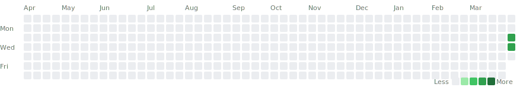

# Workout Trends

> Last updated: 2026-04-02 (auto-generated -- do not edit)

## Consistency

## Week-over-Week Comparison

| Week | Workouts | Total Volume | Avg Duration | vs Prev Week |
|------|----------|-------------|-------------|--------------|
| Mar 30-05 | 2 | 14,030 lbs | 80 min | -- |

## Exercise Trends

### Bench Press (Chest)

| Date | Top Weight | Est. 1RM | Trend |
|------|-----------|----------|-------|
| 2026-04-01 | 155 x 10 | 207 | 🟢 +20 |
| 2026-03-31 | 135 x 10 | 180 | -- |

### Cables lower (Chest)

| Date | Top Weight | Est. 1RM | Trend |
|------|-----------|----------|-------|
| 2026-04-01 | 25 x 9 | 32 | -- |

### Inclined Bench (Chest)

| Date | Top Weight | Est. 1RM | Trend |
|------|-----------|----------|-------|
| 2026-03-31 | 135 x 6 | 162 | -- |

### Inclined DB Press (Chest)

| Date | Top Weight | Est. 1RM | Trend |
|------|-----------|----------|-------|
| 2026-04-01 | 55 x 12 | 77 | -- |

### Triceps Pushdown (Triceps)

| Date | Top Weight | Est. 1RM | Trend |
|------|-----------|----------|-------|
| 2026-03-31 | 50 x 12 | 70 | -- |
